# WinDbg brownbag

## Prerequisites

- [Visual Studio 2017][vs-2017] or [Rider][rider]
- [Sysinternals][sysinternals]:
  - [ProcDump][procdump]
  - [Process Explorer][process-explorer]
- [WinDbg][windbg]
  - [MEX][mex] extension

Configure your [sympath][sympath].

## Slides

The slides can be downloaded [here][windbg-slides].

## Scenarios

### Crash

**Project**: `src\CrashConsole`

**Outline**: a console application crashes on startup with a meaningless exception. We want to get to the initial exception.

**Video walkthrough**: [YouTube][youtube-crash]

1. Compile using the `Release` `Configuration`
1. Browse to the output directory (`src\CrashConsole\bin\Release\net461\`) in the `Command Prompt`
1. Run the console application: `.\CrashConsole.exe`
    - Throws the base `Exception`
    - `Exception` `Message` is meaningless
    - But there is a line number

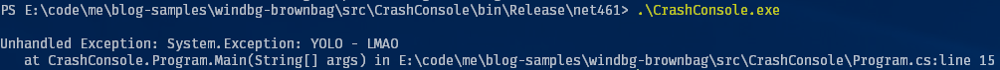

The application swallows all `Exception`s, loses the initial context and instead throws a meaningless exception:

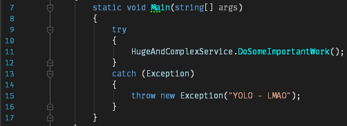

It seems as if we won't be able to retrieve the initial exception.

4. `C:\path-to-procdump\procdump64.exe -e -ma -x C:\dumps .\CrashConsole.exe`
1. Copy `.\CrashConsole.pdb` to your `sympath`
1. Open the dump in `WinDbg`
1. Type the command `!analyze -v` (see [documentation][documentation-analyze-v])
    - Search for `MANAGED_EXCEPTION_ADDRESS`

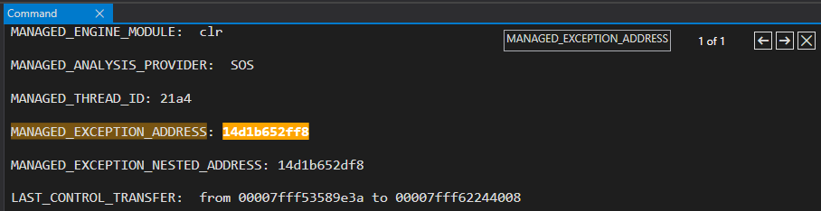

8. Type the command `!pe <address>` (`PrintException`)

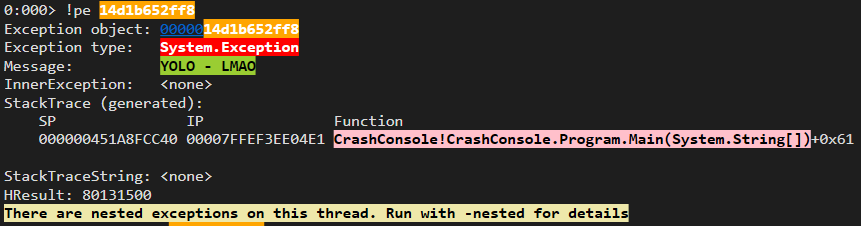

9. Type the command `!pe -nested <address>`

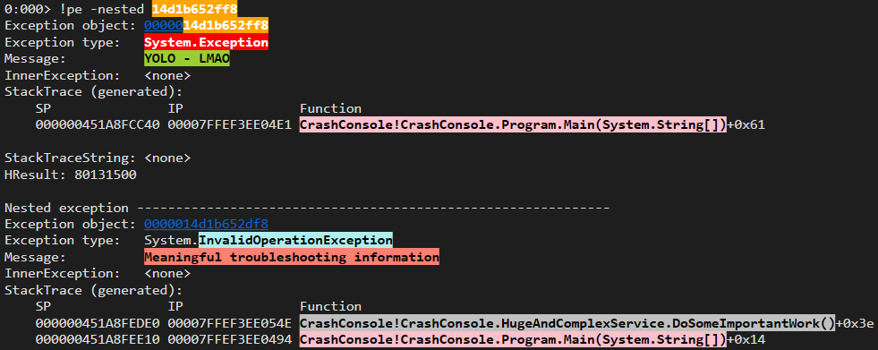

10. Search for the `DoSomeImportantWork` function

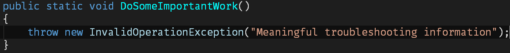

**Note**: if you want to follow through the screenshots and the video walkthrough you can download the [symbols][crash-pdb] and the [dump][crash-dump] I used. The `WinDbg` [output][windbg-crash-output] can be downloaded.

### Hang

#### Hang in ASP.NET WebAPI

**Project**: `src\HangApi`

**Outline**: an ASP.NET WebAPI hangs due to a blocked `async` call. All we see is the hang, how do we get to the faulty line?

**Video walkthrough**: [YouTube][youtube-hang]

1. `Ctrl+F5`
1. `GET http://localhost:5001/hang` multiple times
1. The requests hang
1. `C:\path-to-procdump\procdump64.exe -ma <pid> C:\dumps`
    - Use `Process Explorer` to retrieve the `PID` of `IIS Express` (`PID` is not matching the one in the video walkthrough)

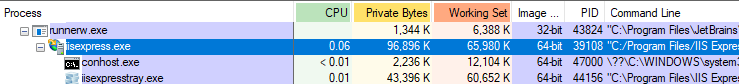

5. Open the dump in `WinDbg`
1. `.load C:\path-to-mex\mex.dll`

```text
0:000> .load E:\symbols\winext\x64\mex.dll
Mex External 3.0.0.7172 Loaded!
```

7. `!mex.runaway2`

```text
0:000> !mex.runaway2
Showing top 10 threads
Thread ID   User Time
==============================
        6 | 0 days 0:00:00.515
       29 | 0 days 0:00:00.093
        0 | 0 days 0:00:00.062
       11 | 0 days 0:00:00.000
        9 | 0 days 0:00:00.000
       10 | 0 days 0:00:00.000
       14 | 0 days 0:00:00.000
       15 | 0 days 0:00:00.000
       12 | 0 days 0:00:00.000
       13 | 0 days 0:00:00.000
==============================
Thread ID   User Time
```

The threads barely consumed any user time on the CPU.

8. `!mex.mthreads`

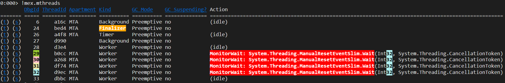

Four managed threads are trying to acquire a monitor.

9. `.loadby sos clr`
1. `!sos.SyncBlk`

```text
0:033> !sos.SyncBlk
c0000005 Exception in C:\Windows\Microsoft.NET\Framework64\v4.0.30319\sos.SyncBlk debugger extension.
      PC: 00007ffe`d7c17c11  VA: 00000000`00000000  R/W: 0  Parameter: 00000000`00000000
0:033> !sos.SyncBlk
Index SyncBlock MonitorHeld Recursion Owning Thread Info  SyncBlock Owner
-----------------------------
Total           72
CCW             5
RCW             15
ComClassFactory 0
Free            0
```

As seen above, you sometimes need to issue this command twice. In this instance we didn't find any `SyncBlk`.

11. `!mex.aspxpagesext`

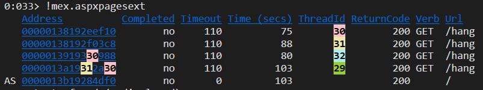

The four managed threads serving the requests are the four threads trying to acquire a monitor.

12. `!mex.us`

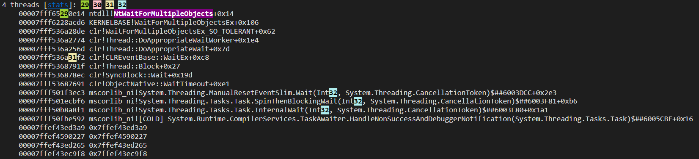

The four managed threads serving the requests have the same stacktrace.

13. `~<thread-id>e !CLRStack`

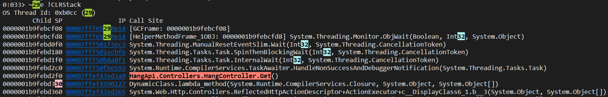

We get the managed stacktrace of one the thread serving the requests.

14. The stacktrace points to a `Controller` `Action`

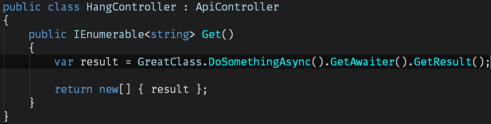

**Note**: if you want to follow through the screenshots and the video walkthrough you can download the [symbols][hang-pdb] and the [dump][hang-dump] I used. The `WinDbg` [output][windbg-hang-output] can be downloaded.

#### No hang in ASP.NET Core

**Project**: `src\NoHangApi`

**Outline**: as ASP.NET Core does not have a synchronization context it won't hang.

1. `Ctrl+F5`
1. `GET http://localhost:5000/no-hang` multiple times
1. The requests complete as expected

## Tools used during the presentation

- [Cmder][cmder] - Portable console emulator for Windows
- [Windows Magnifier][windows-magnifier]
- [Open Broadcaster Software][obs] - free and open source software for video recording and live streaming

[vs-2017]: https://www.visualstudio.com/downloads/
[rider]: https://www.jetbrains.com/rider/
[windbg-slides]: docs/WinDbg.pptx
[sysinternals]: https://docs.microsoft.com/en-us/sysinternals/
[procdump]: https://docs.microsoft.com/en-us/sysinternals/downloads/procdump
[process-explorer]: https://docs.microsoft.com/en-us/sysinternals/downloads/process-explorer
[windbg]: https://github.com/gabrielweyer/nuggets/blob/master/windbg/README.md#download-and-install-windbg
[sympath]: https://github.com/gabrielweyer/nuggets/blob/master/windbg/README.md#configure-the-symbols
[cmder]: http://cmder.net/
[windows-magnifier]: https://support.microsoft.com/en-au/help/11542/windows-use-magnifier
[mex]: https://www.microsoft.com/en-us/download/details.aspx?id=53304
[crash-pdb]: https://gabrielweyer.blob.core.windows.net/blob-samples/windbg-brownbag-1/crash/CrashConsole.pdb
[crash-dump]: https://gabrielweyer.blob.core.windows.net/blob-samples/windbg-brownbag-1/crash/CrashConsole.exe_180422_083132.dmp
[hang-pdb]: https://gabrielweyer.blob.core.windows.net/blob-samples/windbg-brownbag-1/hang/HangApi.pdb
[hang-dump]: https://gabrielweyer.blob.core.windows.net/blob-samples/windbg-brownbag-1/hang/iisexpress.exe_180422_092250.dmp
[obs]: https://obsproject.com/
[youtube-crash]: https://youtu.be/Pw9LnUEc8Q0
[documentation-analyze-v]: https://docs.microsoft.com/en-us/windows-hardware/drivers/debugger/using-the--analyze-extension
[youtube-hang]: https://youtu.be/yWifxJfvJsQ
[windbg-crash-output]: docs/crash/windbg-output.txt
[windbg-hang-output]: docs/hang/windbg-output.txt
