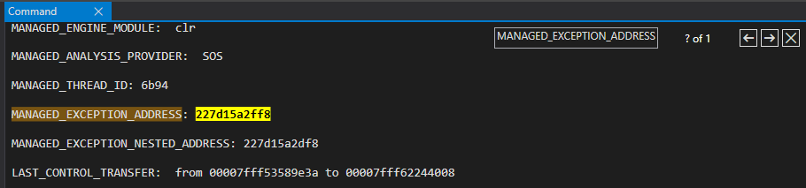
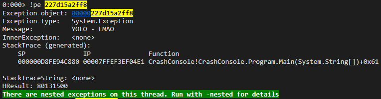
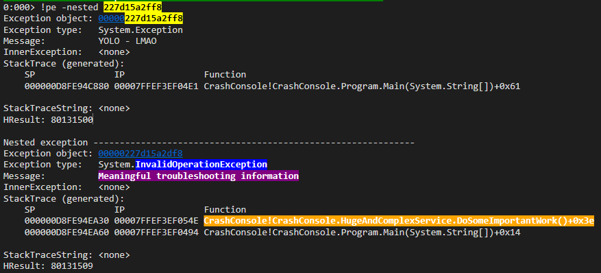

# WinDbg brownbag

## Prerequisites

- [Visual Studio 2017][vs-2017] or [Rider][rider]
- [Sysinternals][sysinternals]:
  - [ProcDump][procdump]
  - [Process Explorer][process-explorer]
- [WinDbg][windbg]
  - [MEX][mex]

Configure your [sympath][sympath].

## Slides

The slides can be downloaded [here][windbg-slides].

## Crash

**Project**: `src\CrashConsole`

1. Compile using the `Release` `Configuration`
1. Browse to the output directory (`src\CrashConsole\bin\Release\net461\`)
1. `C:\path-to-procdump\procdump64.exe -e -ma -x C:\dumps .\CrashConsole.exe`
1. Copy `.\CrashConsole.pdb` to your `sympath`
1. Open the dump in `WinDbg`
1. Type the command `!analyze -v`
1. Search for `MANAGED_EXCEPTION_ADDRESS`

8. Type the command `!pe <address>`

9. Type the command `!pe -nested <address>`

## Hang

### Hang in ASP.NET WebAPI

**Project**: `src\HangApi`

1. `Ctrl+F5`
1. `GET http://localhost:5001/hang` multiple times
1. The requests hang
1. `procdump64.exe -ma <pid>`
1. Open the dump in `WinDbg`
1. `.load C:\path-to-mex\mex.dll`
1. `!mex.runaway2`
1. `!mex.mthreads`
1. `.loadby sos clr`
1. `!sos.SyncBlk`
1. `!mex.aspxpagesext`
1. `!mex.us`
1. `~<thread-id>e !CLRStack`

### No hang in ASP.NET Core

**Project**: `src\NoHangApi`

1. `Ctrl+F5`
1. `GET http://localhost:5000/no-hang` multiple times
1. The requests complete as expected

## Tools used

- [ConEmu][conemu]
- [Windows Magnifier][windows-magnifier]

[vs-2017]: https://www.visualstudio.com/downloads/
[rider]: https://www.jetbrains.com/rider/
[windbg-slides]: docs/WinDbg.pptx
[sysinternals]: https://docs.microsoft.com/en-us/sysinternals/
[procdump]: https://docs.microsoft.com/en-us/sysinternals/downloads/procdump
[process-explorer]: https://docs.microsoft.com/en-us/sysinternals/downloads/process-explorer
[windbg]: https://github.com/gabrielweyer/nuggets/blob/master/windbg/README.md#download-and-install-windbg
[sympath]: https://github.com/gabrielweyer/nuggets/blob/master/windbg/README.md#configure-the-symbols
[conemu]: https://conemu.github.io/
[windows-magnifier]: https://support.microsoft.com/en-au/help/11542/windows-use-magnifier
[mex]: https://www.microsoft.com/en-us/download/details.aspx?id=53304
